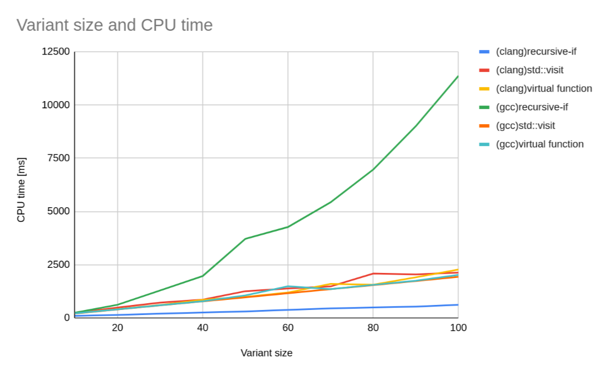
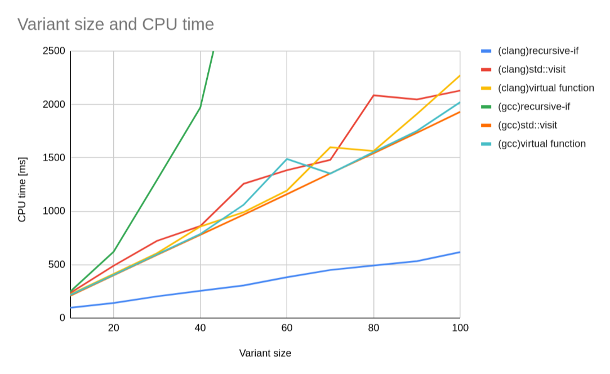

# C++のポリモーフィズムとそのパフォーマンス
## モチベーション
この記事は、C++の仮想関数が実は遅いのではないか、もっと早い方法があるのではないかという思いつきから、それの検証結果をまとめたものである。  
私はC++が好きだが、その専門家ではないため、もし記事の内容に誤りがあれば[Githubリポジトリ](https://github.com/mojyack/blog-source)やTwitterなどから教えてほしい。
## 動的/静的 ポリモーフィズム
C++では、仮想関数で動的ポリモーフィズムを実装できる。
```C++
#include <iostream>

class Animal {
  public:
    virtual auto speak() -> void = 0;
};

class Cat : public Animal {
  public:
    auto speak() -> void override {
        std::cout << "meow\n";
    }
};

class Dog : public Animal {
  public:
    auto speak() -> void override {
        std::cout << "bowwow\n";
    }
};

auto speak_virtual(Animal* animal) -> void {
	// (4) 'animal'の構築方法によってCat::speakとDog::speakとが呼び分けられる
    animal->speak();
}

auto park_virtual() {
    auto cat = Cat(); // (1) 'cat' は 'Cat'型
    auto dog = Dog(); // (2) 'dog' は 'Dog'型
    speak_virtual(&cat);  // (3) でも両方 'Animal*' を取り出せる
    speak_virtual(&dog);
}
```

だが、仮想関数はインライン化による最適化を妨げる。パフォーマンスを上げるなら、できるだけ関数ポインタの使用は避けるべきだ。  
上の例の場合、テンプレートを用いると、同じことが静的ポリモーフィズムで実現できる。
```C++
#include <concepts>
#include <iostream>

// コンセプト 'Animal' の要件を定義する
template <class T>
concept Animal = requires(T& t) {
// 'Animal' は 'speak' というvoidを返す関数を持たなければならない
    { t.speak() } -> std::same_as<void>;
};

class Cat {
  public:
    auto speak() -> void {
        std::cout << "meow\n";
    }
};

class Dog {
  public:
    auto speak() -> void {
        std::cout << "bowwow\n";
    }
};

// コンセプト 'Animal' を満たす何らかの型を受け付ける
template <Animal T>
auto speak_template(T& animal) {
    animal.speak();
}

auto park_template() {
    auto cat = Cat();
    auto dog = Dog();
    speak_template(cat); // 'Cat' は 'Animal' を満たす
    speak_template(dog); // 'Dog' は 'Animal' を満たす
}
```
こうすれば、{Cat, Dog}::speakはインライン化が可能で、パフォーマンスの向上が期待できる。

## 同一の型に代入する
だが、これだけでは仮想関数を置き換えたとは言えない。以下のように、Cat/Dogのインスタンスを一つのvectorに保存する例を考える。
```C++
auto speak_virtual2(std::vector<Animal*> animals) -> void {
    for(auto animal : animals) {
        animal->speak();
    }
}

auto park_virtual2() {
    auto animals = std::vector<Animal*>{new Cat, new Dog};
    speak_virtual2(animals);
}
```

テンプレートを使うと以下のように書きたくなるが、このコードはコンパイルできない。
```C++
auto speak_template2(std::vector<Animal>& animal) {
    for(auto animal: animals) {
        animal.speak();
    }
}

auto park_template2() {
    auto animals = std::vector<Animal>{Cat(), Dog()};
}
```
`std::vector<Animal>`というのはできない。`Animal`はあくまでコンセプト(型が満たすべき要件の名前)であり、具体的な型ではないからである。  
## std::variantを使う
そこで、`std::variant`を使う。`std::variant`は`union`の強化版みたいなやつである([cpprefjp](https://cpprefjp.github.io/reference/variant.html)を読んでほしい)。  
すると、上のコードはこのようになる。
```C++
using SomeAnimal = std::variant<Cat, Dog>;

auto speak_template2(std::vector<SomeAnimal>& animals) {
    for(auto animal : animals) {
        if(animal.index() == 0) {
            // 'animal' には 'Cat' のインスタンスが入っている
            std::get<0>(animal).speak();
        } else if(animal.index() == 1) {
            // 'animal' には 'Dog' のインスタンスが入っている
            std::get<1>(animal).speak();
        }
    }
}

auto park_template2() {
    auto animals = std::vector<SomeAnimal>{Cat(), Dog()};
    speak_template2(animals);
}
```

これで仮想関数と同じことができるようになった。

だが待ってほしい、`speak_virtual2`と`speak_template2`を見比べてみると、`speak_template2`には拡張性がないことがわかる。動物の種類が増えた場合、`speak_virtual2`はそのまま動くが、`speak_template2`は`else if`節を増やさなければならない。これはちょっといただけない。この問題の解決策の一つは、std::visitである。

## std::visitを使う
詳しいことは例によって[cpprefjp](https://cpprefjp.github.io/reference/variant/visit.html)を見てもらうとして、`std::visit`を使うと`speak_template2`は以下のように書き直せる。
```C++
auto speak_template2(std::vector<SomeAnimal>& animals) {
    for(auto animal : animals) {
        std::visit([](auto animal) { animal.speak(); }, animal);
    }
}
```
これで`speak_template2`を書き直さなくても良くなった、めでたしめでたし...
と言いたいが、この方法には問題がある。それは、std::visitが遅いということだ。  
将来は変わるかもしれないが、現時点(clang 15.0.3)の実装では、std::visitは内部で関数ポインタのリストを作る。これでは、仮想関数のときと何も変わらない。後述するベンチマークでも、std::visitは仮想関数と同じくらいのパフォーマンスしか出ないことがわかっている。よって、別の方法を考えなければならない。

## std::visitを使わない
別の方法として私が用意したのは、この関数である。
```C++
template <class V, size_t index = 0>
auto visit(V& variant, auto visitor) -> auto{
    if constexpr(index < std::variant_size_v<V>) {
        if(index == variant.index()) {
            return visitor(std::get<index>(variant));
        }
        return visit<V, index + 1>(variant, visitor);
    }

    // unreachable
    return decltype(visitor(std::get<0>(variant)))();
}
```
愚直にif-elseをネストしていくものだ。私はコンパイラがこの再帰関数を`switch`文のような形に最適化してくれることを期待してこの関数を書いた。実際にコンパイラはこれを最適化できるのか、ベンチマークを行った。

##  ベンチマーク
ベンチマークは、以下のプログラムで行った: [gist](https://gist.github.com/mojyack/cb9980edd1c643bbe9f3aadccc025593)  
このプログラムは、`bench.sh`を実行すると、計測を行い、結果をcsvで出力する。  
計測環境は以下のとおり:
```
> uname -srmpio
Linux 6.0.8-gentoo x86_64 Intel(R) Core(TM) i5-6300U CPU @ 2.40GHz GenuineIntel GNU/Linux
> clang++ --version
clang version 15.0.3
Target: x86_64-pc-linux-gnu
Thread model: posix
...
> g++ --version
g++ (Gentoo 11.3.0 p4) 11.3.0
...
``` 
結果は以下のようになった。なお、自作visit/std::visit/仮想関数の値は計算にかかった時間[ms]であり、この値が小さいほどスコアが高い。

| コンパイラ | コンパイルフラグ | クラス数 | 自作visit | std::visit | 仮想関数 |
|--|--|--|--|--|--|
clang++ | -O2 | 10 | 97.033 | 234.817 | 221.076 |
clang++ | -O2 | 20 | 141.387 | 490.131 | 413.372 |
clang++ | -O2 | 30 | 203.286 | 723.042 | 607.475 |
clang++ | -O2 | 40 | 255.035 | 861.751 | 856.832 |
clang++ | -O2 | 50 | 305.896 | 1257.91 | 991.581 |
clang++ | -O2 | 60 | 382.367 | 1385.04 | 1194.56 |
clang++ | -O2 | 70 | 450.464 | 1481.31 | 1600.22 |
clang++ | -O2 | 80 | 492.322 | 2086.06 | 1564.57 |
clang++ | -O2 | 90 | 533.243 | 2047.01 | 1911.61 |
clang++ | -O2 | 100 | 618.091 | 2130.54 | 2274.01 |
clang++ | -O2 -march=native | 10 | 87.757 | 253.382 | 219.609 |
clang++ | -O2 -march=native | 20 | 166.153 | 444.994 | 445.919 |
clang++ | -O2 -march=native | 30 | 236.934 | 652.188 | 651.866 |
clang++ | -O2 -march=native | 40 | 281.385 | 858.436 | 796.791 |
clang++ | -O2 -march=native | 50 | 337.698 | 1072.3 | 1063.68 |
clang++ | -O2 -march=native | 60 | 424.743 | 1269.64 | 1472.21 |
clang++ | -O2 -march=native | 70 | 451.75 | 1989.17 | 1378.57 |
clang++ | -O2 -march=native | 80 | 513.329 | 1842.56 | 1921.86 |
clang++ | -O2 -march=native | 90 | 575.712 | 2062.67 | 1770.23 |
clang++ | -O2 -march=native | 100 | 626.588 | 2103.54 | 1968.92 |
clang++ | -O3 | 10 | 94.529 | 216.833 | 216.673 |
clang++ | -O3 | 20 | 157.228 | 444.92 | 403.178 |
clang++ | -O3 | 30 | 224.791 | 655.307 | 592.329 |
clang++ | -O3 | 40 | 264.172 | 922.451 | 859.69 |
clang++ | -O3 | 50 | 352.95 | 1156.16 | 1114.9 |
clang++ | -O3 | 60 | 433.706 | 1276.92 | 1170.57 |
clang++ | -O3 | 70 | 456.251 | 1602.15 | 1464.3 |
clang++ | -O3 | 80 | 535.051 | 1702 | 1557.87 |
clang++ | -O3 | 90 | 633.928 | 1738.01 | 2148.94 |
clang++ | -O3 | 100 | 672.476 | 1950.06 | 2212.1 |
clang++ | -O3 -march=native | 10 | 85.519 | 215.345 | 212.717 |
clang++ | -O3 -march=native | 20 | 161.783 | 400.061 | 409.75 |
clang++ | -O3 -march=native | 30 | 231.689 | 590.054 | 600.353 |
clang++ | -O3 -march=native | 40 | 262.328 | 859.299 | 785.118 |
clang++ | -O3 -march=native | 50 | 366.56 | 982.333 | 1205.75 |
clang++ | -O3 -march=native | 60 | 401.049 | 1269.82 | 1173.84 |
clang++ | -O3 -march=native | 70 | 443.28 | 1377.44 | 1374.58 |
clang++ | -O3 -march=native | 80 | 518.75 | 1611.39 | 1611.92 |
clang++ | -O3 -march=native | 90 | 582.389 | 1752.67 | 1748.15 |
clang++ | -O3 -march=native | 100 | 626.982 | 2460.16 | 2706.08 |
g++ | -O2 | 10 | 248.107 | 209.287 | 216.098 |
g++ | -O2 | 20 | 620.707 | 400.464 | 404.299 |
g++ | -O2 | 30 | 1292.34 | 592.015 | 596.079 |
g++ | -O2 | 40 | 1970.54 | 780.023 | 787.015 |
g++ | -O2 | 50 | 3716.85 | 968.304 | 1060.89 |
g++ | -O2 | 60 | 4271.83 | 1160.52 | 1489.96 |
g++ | -O2 | 70 | 5432.89 | 1354.62 | 1352.89 |
g++ | -O2 | 80 | 6969.79 | 1544.44 | 1555.04 |
g++ | -O2 | 90 | 9008.94 | 1735.4 | 1752.58 |
g++ | -O2 | 100 | 11373 | 1931.97 | 2022.51 |
g++ | -O2 -march=native | 10 | 252.933 | 214.043 | 207.293 |
g++ | -O2 -march=native | 20 | 637.273 | 398.34 | 440.471 |
g++ | -O2 -march=native | 30 | 1121.94 | 598.113 | 591.298 |
g++ | -O2 -march=native | 40 | 2037.67 | 779.267 | 782.824 |
g++ | -O2 -march=native | 50 | 3727.58 | 974.498 | 971.101 |
g++ | -O2 -march=native | 60 | 4385.45 | 1163.93 | 1536.86 |
g++ | -O2 -march=native | 70 | 5544.48 | 1366.66 | 1357.61 |
g++ | -O2 -march=native | 80 | 7374.18 | 1545.79 | 1682.08 |
g++ | -O2 -march=native | 90 | 9138.98 | 1720.69 | 1752.4 |
g++ | -O2 -march=native | 100 | 11339.1 | 1929.87 | 2032.89 |
g++ | -O3 | 10 | 204.035 | 206.24 | 214.124 |
g++ | -O3 | 20 | 633.946 | 397.05 | 400.914 |
g++ | -O3 | 30 | 1218.96 | 590.651 | 586.704 |
g++ | -O3 | 40 | 1988.95 | 777.166 | 783.557 |
g++ | -O3 | 50 | 3124.02 | 1140.46 | 978.282 |
g++ | -O3 | 60 | 4229.49 | 1365.2 | 1620.03 |
g++ | -O3 | 70 | 5632.49 | 1594.41 | 1353.67 |
g++ | -O3 | 80 | 6945.6 | 1811.83 | 1553.93 |
g++ | -O3 | 90 | 8822.34 | 2190.55 | 1753.45 |
g++ | -O3 | 100 | 11114.5 | 2799.2 | 1940.48 |
g++ | -O3 -march=native | 10 | 202.966 | 206.025 | 215.983 |
g++ | -O3 -march=native | 20 | 634.863 | 401.419 | 400.082 |
g++ | -O3 -march=native | 30 | 1212.29 | 592.703 | 589.978 |
g++ | -O3 -march=native | 40 | 1983.95 | 776.102 | 782.775 |
g++ | -O3 -march=native | 50 | 3125.77 | 1136.91 | 977.305 |
g++ | -O3 -march=native | 60 | 4264.52 | 1364.53 | 1362.77 |
g++ | -O3 -march=native | 70 | 5626.41 | 1591.53 | 1355.24 |
g++ | -O3 -march=native | 80 | 6902.98 | 1808.91 | 1549.3 |
g++ | -O3 -march=native | 90 | 8832.96 | 2185.94 | 1744.19 |
g++ | -O3 -march=native | 100 | 11092.5 | 2785.16 | 1937.83 |

この表から`clang++ -O2`と`g++ -O2`の行をそれぞれ抜き出してプロットすると、以下のグラフのようになった。
グラフ中のrecursive-ifとは自作visit関数のことである。  
さて、際立っているのは、clangのrecursive-ifとgccのrecursive-ifである。前者は圧倒的に早いが、後者は圧倒的に遅い。  
前者が早いことから、clangは自作visitを想定どおりに最適化していると予想される。  
一方、後者については、その計算時間がクラス数に対してべき級数的に増加していることから、gccは自作visitをそのまま再帰関数としてコンパイルしたことが予想される。  
これらの傾向は-O3フラグをつけても変わらないため、clangはこの関数を最適化できるが、gccはできない、という結論になった。  
その他の方法、std::visitや仮想関数については、どれも似たような値が出ている。それを確かめるため、縦軸の最大値を2500に固定したグラフも用意した。
若干gccのstd::visitが早い気もするが、どれも同じようなものと言っていいだろう。
## まとめ
最適化が効くコンパイラを使うなら、自作visitの方法を使うのが最も早いことがわかった。逆に、そのようなコンパイラを使えないなら、仮想関数から乗り換えてもあまり効果はなさそうである。
